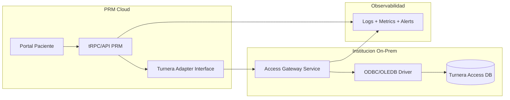

# Propuesta Tecnica: Integracion de Turnera basada en Microsoft Access
**Proyecto:** Patient Management Platform (PRM)
**Estado:** Borrador tecnico v0.1
**Objetivo:** Definir una integracion robusta entre PRM y una Turnera cuya fuente de datos sea Access (.accdb/.mdb), desacoplando el portal del motor legacy.

---

## 1. Contexto y Alcance

Esta propuesta cubre:
- Lectura de agendas y disponibilidad.
- Alta, reprogramacion y cancelacion de turnos.
- Sincronizacion de cambios desde Turnera hacia PRM.
- Estrategia operativa para entornos donde Access es on-premise.

Fuera de alcance en esta version:
- Reemplazo total del sistema Turnera.
- Migracion completa de base Access a otro motor.
- Facturacion y autorizaciones de obra social.

---

## 2. Principio de Arquitectura

PRM no debe conectarse directo al archivo Access desde internet.
Se recomienda una capa puente local (Access Gateway) dentro de la red de la institucion.



Beneficios:
- Aisla Access y evita exponer archivos compartidos.
- Permite aplicar seguridad, cache e idempotencia en el Gateway.
- Hace intercambiable la fuente legacy en el futuro.

---

## 3. Opciones de Integracion

### Opcion A (Recomendada): Gateway local + API HTTPS
- Un microservicio local (Windows service o contenedor en host Windows) accede a Access por ODBC/OLEDB.
- PRM consume endpoints HTTPS del Gateway.
- El Gateway encapsula SQL Access y reglas legacy.

### Opcion B: Replicacion a staging SQL + consumo desde PRM
- Job local exporta tablas Access a Postgres/SQL Server intermedio.
- PRM opera sobre staging y publica cambios de vuelta por cola o job.
- Mejora rendimiento de lectura masiva, pero agrega complejidad de consistencia.

### Opcion C (No recomendada): Conexion directa PRM -> archivo Access
- Alto riesgo de seguridad, lock de archivo, latencia y dependencia de red interna.

---

## 4. Contrato Canonico Propuesto

PRM trabaja con un modelo canonico para no depender de nombres de tabla/columna legacy.

```ts
export interface TurneraAdapter {
  getAvailableSlots(input: {
    institutionId: string;
    specialtyId: string;
    doctorId?: string;
    from: string; // ISO datetime
    to: string;   // ISO datetime
  }): Promise<Slot[]>;

  createAppointment(input: {
    institutionId: string;
    patientExternalId: string;
    slotExternalId: string;
    reason?: string;
    channel: "PORTAL" | "CALL_CENTER" | "FRONT_DESK";
  }): Promise<AppointmentResult>;

  rescheduleAppointment(input: {
    institutionId: string;
    appointmentExternalId: string;
    newSlotExternalId: string;
  }): Promise<AppointmentResult>;

  cancelAppointment(input: {
    institutionId: string;
    appointmentExternalId: string;
    reason?: string;
  }): Promise<{ ok: boolean }>;

  pullChanges(input: {
    institutionId: string;
    since: string; // watermark ISO
    pageSize?: number;
  }): Promise<ExternalChangeBatch>;
}
```

---

## 5. Mapeo Inicial (placeholder)

Completar cuando se reciban servicios reales.

| Dominio canonico | Tabla/consulta Access | Campo Access | Campo PRM |
|---|---|---|---|
| Paciente | TBD | TBD | patient.hisId |
| Profesional | TBD | TBD | professional.licenseNumber |
| Especialidad | TBD | TBD | appointment.specialty |
| Agenda/Slot | TBD | TBD | slot.start, slot.end |
| Turno | TBD | TBD | appointment.hisRef |
| Estado turno | TBD | TBD | PENDING/CONFIRMED/CANCELLED |

Regla clave:
- Mantener ID externo immutable (hisRef/externalId) para idempotencia.

---

## 6. Sincronizacion y Consistencia

### 6.1 Lectura (Pull)
- PRM pide disponibilidad y turnos por demanda.
- Cache corto (30-120 segundos) por especialidad/profesional.

### 6.2 Cambios desde Turnera
- Si Turnera no soporta webhook, usar polling incremental por watermark (fecha_modificacion).
- Si no existe columna de modificacion, crear tabla de auditoria en Access Gateway.

### 6.3 Escrituras hacia Turnera
- Operaciones create/reschedule/cancel deben ser idempotentes con requestId.
- Guardar bitacora de request/response en PRM y Gateway.

### 6.4 Reconciliacion
- Job nocturno compara turnos del dia siguiente y corrige desvio.
- Alertar diferencias de estado y profesionales no mapeados.

---

## 7. Seguridad

Minimos obligatorios:
- mTLS o API key rotativa entre PRM y Gateway.
- Allowlist de IP origen.
- Secrets fuera de codigo (vault o variables seguras).
- No exponer rutas internas de Access.
- Auditoria por cada acceso de datos clinicos.

---

## 8. Riesgos especificos de Access y mitigaciones

1. Lock de archivo y concurrencia limitada.
- Mitigacion: serializar escrituras criticas en Gateway y usar retries con backoff.

2. Esquema legacy sin timestamps consistentes.
- Mitigacion: watermark administrado en Gateway + tabla de control de cambios.

3. Cortes de red on-prem.
- Mitigacion: cola local persistente para operaciones salientes y reintento automatico.

4. Calidad de datos (codigos de estado no normalizados).
- Mitigacion: tabla de homologacion por institucion y validacion previa.

---

## 9. Variables de entorno sugeridas

```env
TURNERA_ADAPTER_TYPE=ACCESS_GATEWAY
TURNERA_GATEWAY_BASE_URL=https://turnera-gw.institucion.local
TURNERA_GATEWAY_AUTH_TYPE=API_KEY
TURNERA_GATEWAY_API_KEY=replace_me
TURNERA_TIMEOUT_MS=5000
TURNERA_RETRY_MAX=3
TURNERA_RETRY_BACKOFF_MS=250
TURNERA_POLLING_ENABLED=true
TURNERA_POLLING_INTERVAL_SEC=30
```

---

## 10. Plan de implementacion por fases

### Fase 0 - Descubrimiento tecnico (3-5 dias)
- Inventario de tablas/consultas Access.
- Diccionario de estados de turno.
- Validacion de volumen diario y horarios pico.

### Fase 1 - Conector minimo viable (1-2 semanas)
- Endpoint de slots y createAppointment.
- Mapeo de IDs externos.
- Logs y trazas de punta a punta.

### Fase 2 - Operacion completa (1-2 semanas)
- Reschedule, cancel y pullChanges incremental.
- Reconciliacion diaria.
- Alertas operativas.

### Fase 3 - Hardening productivo (1 semana)
- Idempotencia completa.
- Pruebas de falla y recovery.
- Dashboard de SLA y errores.

---

## 11. Criterios de aceptacion (DoD)

- Disponibilidad de slots consistente con Turnera (desvio < 1%).
- Create/reschedule/cancel con trazabilidad completa.
- Idempotencia validada en reintentos.
- Latencia p95 de operaciones criticas < 2.5 s (sin contar indisponibilidad on-prem).
- Runbook de incidentes y procedimiento de contingencia documentado.

---

## 12. Informacion pendiente para completar con tus servicios

Cuando compartas los servicios, completar:
1. Endpoints reales (URL, metodo, auth, timeout).
2. Contratos request/response exactos.
3. Catalogo de estados y codigos de error.
4. Reglas de negocio de sobre-turnos, bloqueo y cupos.
5. Estrategia de confirmacion de turnos (sincronica o asincronica).

---

## 13. Siguiente entregable

Con los servicios reales, se genera un documento v1.0 con:
- Mapeo campo a campo cerrado.
- Matriz de errores y reintentos.
- Casos de prueba de integracion (felices y fallos).
- Plan de cutover por institucion.
